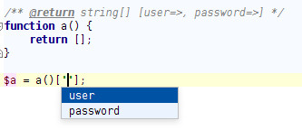

Very simple PHPStorm plugin
===========================



Usage in PHPStorm
-----------------

Install plugin, _CTRL+SPACE_ inside array keys.

Example:

```phg
/** @return string[] [user=>, password=>] */
function a() {
    return [];
}

$a = a()[''];
```

Setting up
----------

* New project -> IntelliJ Plugin -> Project SDK
 * Choose PHP storm installation
* Update meta info
* Run (PHP storm will be loaded)
 * You can check settings, your new plugin is there

Troubleshooting
---------------

* Run/Debug Configuration -> Show idea log 
* Wipe sandbox ~/.IdeaIC14/system/plugins-sandbox

Useful links
------------

* https://confluence.jetbrains.com/display/PhpStorm/Setting-up+environment+for+PhpStorm+plugin+development
* https://confluence.jetbrains.com/display/PhpStorm/PHP+Open+API

Dependencies
------------

* php-openapi
* junit:junit:4.8.1

Author
------
Aurelijus Banelis

License
-------
Apache 2